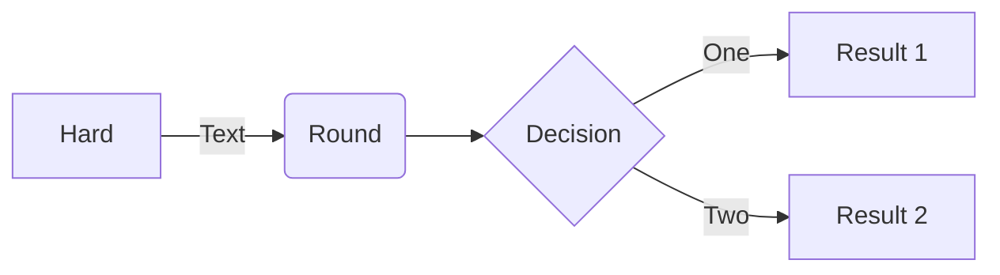

## Introduction

This is a initial blog to check chirpy theme


## Features?

I chose chirpy because...

```python
print("code snippets")
```

A $\it \text{MATH}$ support

A image support with
```
{: w="700" h="400" }
{: .normal }
{: .right }
{: .center}
{: .shadow }
```

{: w="100" h="200" .center }

And also a rich prompt

	
> Like this
{: .prompt-info }

Furtheremore, there are extra options like:

```
{: .nolineno }
{: file="path/to/file" }
``` 
{: file="display.yml" }


Eventhough I am not sure if I will use it,
there is a mermaid tool as well:



Now, I can post more often :)

